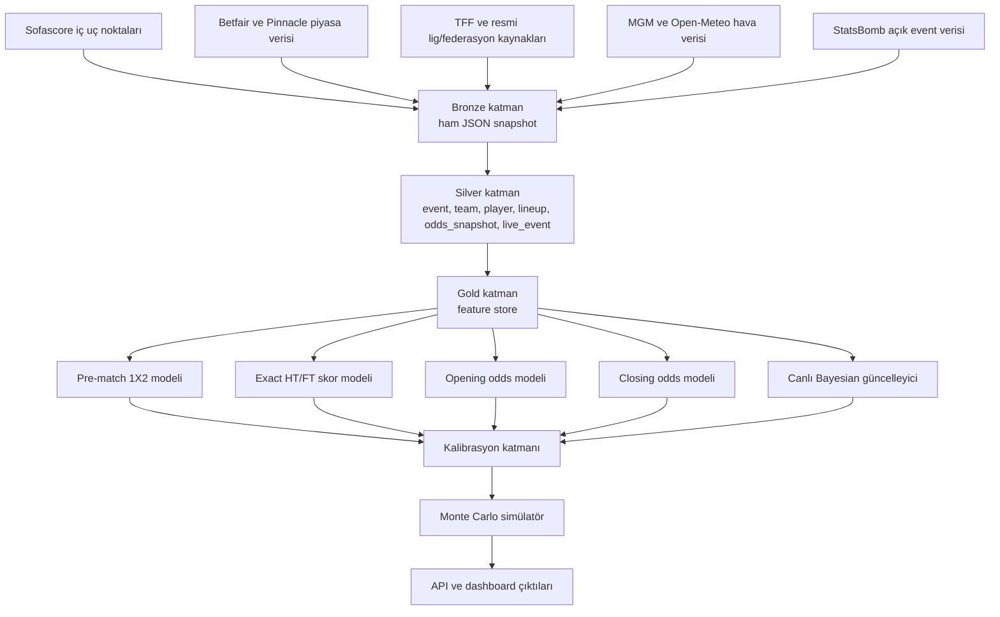
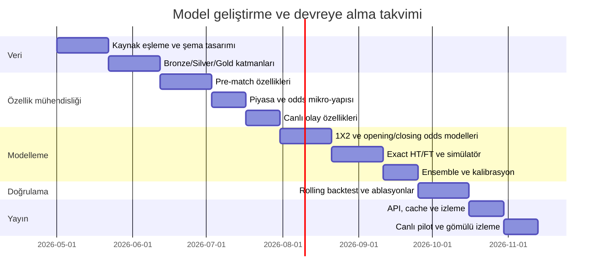

# Futbol Maç Simülasyonu ve Tahmin Sistemi Tasarımı

## Yönetici Özeti

Bu araştırmanın en kritik bulgusu şudur: Sofascore, resmi olarak paylaşılmış bir spor veri API’si sunmuyor; kendi yardım dokümanında, veri sağlayıcı anlaşmaları nedeniyle “API endpoint” paylaşamayacağını açıkça söylüyor ve resmi entegrasyon yolu olarak widget tarafına yönlendiriyor. Buna rağmen kamuya açık topluluk dokümantasyonu, açık kaynak sarmalayıcılar ve saha gözlemleri; `https://api.sofascore.com/api/v1` kökünden çalışan çok sayıda iç uç noktanın varlığına işaret ediyor. Dolayısıyla Sofascore, araştırma ve prototip aşamasında çok değerli bir kaynak olsa da, üretimde tek başına “resmi ve garantili ana feed” gibi ele alınmamalıdır; lisanslı piyasa verisi, resmi federasyon/lig/meteoroloji kaynakları ve mümkünse exchange verisi ile tamamlanmalıdır. citeturn42view1turn9search2turn31search2turn10view0turn9search1turn11search1

Hedef performans tarafında da çıta çok yüksektir. Akademik literatür ve bahis piyasası sonuçları, 1X2 maç sonucu tahmininde bahis oranlarının kamuya açık en güçlü baz çizgilerden biri olduğunu; bazı klasik çalışmalarda bu baz çizginin hit-rate’inin yaklaşık %53 civarında kaldığını; kapanış oranlarının açılış oranlarından sistematik olarak daha doğru olduğunu ve piyasanın maç yaklaştıkça bilgiyi daha iyi içselleştirdiğini gösteriyor. Ayrıca tam skor ve özellikle devre/maç sonu tam skor tahmini, sonuç uzayı çok daha büyük olduğu için 1X2’ye kıyasla doğal olarak daha zordur. Bu yüzden “tüm maçlarda, her zaman, top-1 tahmin” rejiminde `%80+ 1X2 doğruluk` ve `%25+ exact HT/FT doğruluk` hedefleri gerçekçi değildir; bu hedefler ancak **kapsam kontrollü seçici tahmin** yaklaşımıyla, yani model yalnızca yeterince emin olduğu maçlarda tahmin verdiğinde, savunulabilir hale gelir. citeturn24view1turn33view0turn14view4turn24view0turn33view1

Bu nedenle önerilen sistem tek bir modelden değil, dört katmandan oluşmalıdır: pre-match sonuç olasılığı modeli, exact HT/FT skor dağılımı modeli, açılış/kapanış oranı mikro-yapı modeli ve canlı maç güncelleme modeli. En iyi pratik çözüm; dinamik Poisson ailesi, tablosal gradyan artırmalı modeller, market-implied fair probability katmanı ve canlı Bayesian güncelleyiciyi bir araya getiren kalibre edilmiş bir ensemble’dır. Bu tasarım hem simülasyon üretir, hem de bahis şirketi açılış/kapanış oranlarına yakın piyasa tahmini verir. citeturn16view2turn16view1turn14view0turn26view0turn24view0

## Veri Mimarisi ve Kaynaklar

Sistem mimarisinde veri kaynakları hiyerarşik ele alınmalıdır. Ana olay-akış verisi ve geniş kapsama için Sofascore; piyasa mikro-yapısı için entity["company","Betfair","exchange betting company"] ve gerekiyorsa entity["company","Pinnacle","sportsbook company"]; event-level kalibrasyon ve xG türetimi için entity["organization","StatsBomb","football data provider"]; Türkiye odaklı resmi durum, ceza, hakem ve puan tablosu için entity["organization","Türkiye Futbol Federasyonu","ankara turkey football fed"]; hava için entity["organization","Meteoroloji Genel Müdürlüğü","ankara turkey weather agency"] ve Open-Meteo birlikte kullanılmalıdır. Sofascore resmi olarak API vermediği için, buradaki strateji “araştırma/prototipte Sofascore + üretimde lisanslı/kurumsal yedek feed” olmalıdır. citeturn42view1turn29view0turn29view1turn29view2turn30view0turn22search0turn22search2turn22search4turn39search0turn29view3

| Katman | Kaynak | Ne sağlar | Artılar | Riskler |
|---|---|---|---|---|
| Geniş kapsam match/team/player | Sofascore iç uç noktaları | Fikstür, canlı maç, lineups, oyuncu detayları, takım formu, karşılaştırmalar, oran görünümü | Çok geniş kapsama, canlı güncelleme, pratik zenginlik | Resmi değil, şema kırılabilir, rate-limit belirsiz |
| Piyasa mikro-yapısı | Betfair Historical / Exchange API | Timestamp’li exchange fiyatları, settlement, matched-volume tabanlı likidite göstergeleri | Gerçek piyasa akışına en yakın kaynak | Ücretli veya erişim kısıtlı olabilir |
| Sharp bookmaker referansı | Pinnacle veri servisi/API | Pre-match odds, delta/snapshot mantığı, sharp-line referansı | Kapanış çizgisi modellemesi için güçlü anchoring | Temmuz 2025’ten beri genel kamuya kapalı |
| Event-level açık veri | StatsBomb Open Data | Events, lineups, match JSON, seçili 360 verisi | xG/xThreat ve oyuncu-rol kalibrasyonu için ideal | Kapsam sınırlı, tüm ligler yok |
| Resmi fixture/standings/referee/discipline | TFF | Puan durumu, fikstür, hakem atamaları, PFDK kararları | Türkiye için birincil doğruluk | Türkiye dışı kapsam yok |
| Hava ve saha koşulları | MGM + Open-Meteo | Saatlik hava, rüzgâr, yağış, nem, geçmiş veri | Türkiye için resmi; globalde tarihsel erişim güçlü | Stadyum koordinatı eşleme gerekir |
| Yedek fixture API | football-data.org | Competition/match metadata, throttled REST API | Resmi dokümantasyon, düzenli JSON şema | Ücretsiz plan hız ve kapsam limitli |

Kaynak notu: Sofascore’ın resmi API paylaşmama politikası ve widget yönlendirmesi kendi yardım sayfasında; Betfair, Pinnacle, Open-Meteo ve football-data.org tarafındaki erişim/rate-limit davranışları ise resmi geliştirici dokümanlarında yer alıyor. TFF ve MGM, Türkiye’ye dönük birincil resmi kaynak olarak kullanılmalıdır. citeturn42view1turn29view0turn29view1turn29view2turn29view3turn29view4turn22search0turn22search2turn22search4turn39search0

Sofascore için pratik gerçeklik, “uç nokta keşfi var ama sözleşmesel/public API güvencesi yok” yapısıdır. Kamuya açık işaretler; `config/unique-tournaments`, sport/category listeleri, gün bazlı scheduled-events, canlı events, event detail, lineups, shotmap, graph/momentum, average positions, player heatmap, player/match/team stats ve odds uç noktalarına işaret ediyor. Ayrıca takım sayfaları; coach, venue, kadro, form grafiği, son 100 maç ve oyuncu profili alanlarının kullanıldığını açıkça gösteriyor. Bu da, bir tahmin sistemi için gereken çekirdek nesnelerin büyük bölümünün Sofascore üzerinde temsil edildiğini gösterir. citeturn31search2turn9search2turn10view0turn9search1turn21view0turn21view1turn43view0turn38view0turn21view3

| Sofascore yol örüntüsü | Amaç | Tipik alanlar | Kanıt niteliği |
|---|---|---|---|
| `/config/unique-tournaments/{language}/{sport}` | Turnuva listesi/konfigürasyon | `uniqueTournaments`, `topUniqueTournamentIds` | Açık topluluk OpenAPI |
| `/sport/{sport}/categories` | Spor kategorileri | `categories[].id,name,...` | Açık topluluk OpenAPI |
| `/sport/football/scheduled-events/{date}` | Günlük maç listesi | event listesi | Topluluk + saha gözlemi |
| `/sport/football/scheduled-events/{date}/inverse` | “Show all” sonrası tam günlük liste | daha geniş event listesi | Topluluk saha gözlemi |
| `/sport/football/events/live` | Canlı maçlar | live events | Topluluk/wrapper ekosistemi |
| `/event/{match_id}` | Tek maç özeti | `event.homeTeam`, `event.awayTeam`, skor/durum | Wrapper ve ScraperFC belgeleri |
| `/event/{match_id}/lineups` | Kadrolar | `home.players`, `away.players` | Wrapper ve ScraperFC belgeleri |
| `/event/{match_id}/graph` | Momentum grafiği | `graphPoints` | Wrapper kodu |
| `/event/{match_id}/shotmap` | Şut olayları | shot bazlı kayıtlar | ScraperFC ve wrapper ekosistemi |
| `/event/{match_id}/average-positions` | Ortalama pozisyonlar | `home/away`, `averageX`, `averageY` | Wrapper kodu |
| `/event/{match_id}/player/{player_id}/heatmap` | Oyuncu ısı haritası | `heatmap` | Wrapper kodu |
| `/event/{match_id}/odds/1/featured` | Pre-match odds görünümü | featured odds / opening-style fields | Tez/araştırma kaynakları |
| `/event/{match_id}/odds/1/all` | Daha geniş odds alanı/tarihçe | all odds | Tez/araştırma + saha gözlemi |
| Turnuva/sezon/istatistik uçları | Lig/sezon toplu oyuncu/takım istatistiği | leaderboards, season stats | ScraperFC ve wrapper ekosistemi |

Kaynak notu: Bu tablodaki yolların önemli bir kısmı resmi dokümanla değil, topluluk OpenAPI tanımları, açık kaynak sarmalayıcılar, ScraperFC dokümantasyonu, tezler ve saha gözlemleriyle doğrulanabiliyor. Sofascore’ın resmi pozisyonu ise bu endpoint’lerin kamuya açık API olarak paylaşılmadığı yönünde. Bu yüzden tablo “keşfedilmiş ve fiilen kullanılan iç uç noktalar” tablosu olarak okunmalıdır; “resmi ve SLA’li ürün API’si” tablosu olarak değil. citeturn42view1turn9search2turn31search2turn10view0turn9search1turn11search1turn6search3turn6search4

Rate-limit tarafında Sofascore için resmi ve güvenilir bir eşik yayımlanmamış durumda. Üstelik resmi yardım dokümanı zaten endpoint paylaşımını reddediyor. Toplulukta ise iki pratik gözlem öne çıkıyor: agresif polling’de eksik veri/engelleme yaşanabildiği ve bazı sarmalayıcıların istek aralarına rastgele uyku koyduğu görülüyor. Bu nedenle toplama stratejisi sabit bir “RPS” varsaymak yerine; endpoint bazlı canary, exponential backoff, etag/hash tabanlı dedup, agresif cache ve “as-of timestamp” saklama üzerine kurulmalıdır. Ayrıca bazı liglerde oyuncu rating ve detay istatistikleri saatler hatta günler sonra gelebilir; bu da eğitim veri setinde freshness sütunu tutmayı zorunlu kılar. citeturn42view1turn9search1turn4search0turn21view2

Bu akışın kilit ilkesi, her kaydı tek bir “provider timestamp” ile dondurmak ve özellikleri hedefe göre farklı gözlem anlarına bağlamaktır: açılış oranı modeli yalnızca açılış anına kadar bilinenlerle, kapanış oranı modeli ise kickoff öncesi son güvenli anla, canlı model ise event-stream ile beslenmelidir. Temel kaçaklık önleme kuralı budur. citeturn14view4turn29view0turn29view2turn21view2

## Özellik Uzayı ve Hedef Değişkenler

Aşağıdaki özellik envanteri, kullanıcı isteğinde geçen bütün girdileri kapsayacak şekilde “kaynak, güncelleme, ön işleme, temsil” ekseninde tasarlandı. Kaynak sütununda “Sofascore” yalnızca makul ölçüde oradan alınabilir alanlar için kullanıldı; geri kalanı özellikle “Belirsiz” veya “Sofascore + Belirsiz” olarak bırakıldı, çünkü bu alanlar resmi kulüp/lig/federasyon veya lisanslı piyasa sağlayıcısı gerektirebilir. Sofascore tarafında lineups, H2H, team comparison, athlete profile/attributes, recent form, odds görünümü ve canlı maç istatistikleri bulunuyor; TFF ve MGM gibi resmi Türkçe kaynaklar ise hakem/ceza/hava tarafında güçlü birincil tamamlayıcılardır. citeturn21view0turn21view1turn38view0turn43view0turn21view3turn37view0turn37view1turn39search0turn22search0turn22search2turn22search4

| Özellik grubu | Alt alanlar | Kaynak | Güncelleme | Ön işleme | Önerilen temsil |
|---|---|---|---|---|---|
| Hakem istatistikleri | maç başı faul, sarı/kırmızı, penaltı, ev/deplasman bias, avantaj süresi | Belirsiz; Türkiye için TFF destekli | Haftalık / maç ataması sonrası | isim eşleme, sezon normalizasyonu, lig-bağımlı z-score | skaler + hakem embedding |
| Oyuncu öznitelikleri | yaş, boy, ayak, pozisyon, piyasa değeri, milliyet, rol | Sofascore + Belirsiz | Günlük/haftalık | entity resolution, yaş dönüştürme, pozisyon ontolojisi | oyuncu embedding + squad aggregate |
| Oyuncu formu | son N maç rating, dakika, xG/xA proxy, şut/pas/defans aksiyonları | Sofascore | Maç sonrası, bazı liglerde gecikmeli | rolling windows, EWMA, dakika-ağırlıklandırma | zaman serisi + rolling summary |
| Sakatlık/ceza/uygunluk | out/doubtful, suspension, expected XI availability | Sofascore + Belirsiz (kulüp/federasyon) | Günlük, kickoff’a yakın sıklaşır | isim eşleme, missingness flag, availability probability | Bernoulli/olasılık vektörü |
| Teknik direktör geçmişi | görev süresi, takım değişimleri, yeni hoca etkisi | Belirsiz | Günlük/olay bazlı | tenure hesaplama, change-point flag | skaler + manager embedding |
| Teknik direktör taktik profili | formasyon tercihleri, pressing/directness proxy, oyuncu değişikliği paterni | Sofascore + Belirsiz | Maç bazlı | formation parsing, role clustering, trailing/leading splits | sekans özetleri + embedding |
| Takım formu | son 5/10 maç, xG benzeri kalite, isabetli şut, duran top verimi, clean sheet | Sofascore | Canlı/maç sonrası | rolling EWMA, opponent-strength adjustment | takım zaman serisi |
| H2H | son N resmi maç, skor, kart, xG proxy, style matchup | Sofascore | Maç bazlı | tarihe göre decay, kadro değişim filtresi | kısa sekans + dikkat ağı |
| İç saha/deplasman | home advantage, stadyum, kapasite, şehir, saha etkisi | Sofascore + Belirsiz | Düşük frekans / maç bazlı | venue geocode, league-specific baseline | skaler + venue embedding |
| Maç önemi / format | lig-kupa, ilk/ikinci maç, tek maç, eleme, uzatma ihtimali | Sofascore + resmi müsabaka statüsü | Sezon öncesi + maç bazlı | categorical encoding, leg-state derivation | one-hot + hierarchical embedding |
| Küme düşme baskısı | emniyet çizgisine puan farkı, kalan maç sayısı, expected points need | Sofascore + resmi puan tablosu | Haftalık / maç günü | league-table snapshot, monotonic transforms | baskı indeksi |
| Şampiyonluk / Avrupa baskısı | lider/top4/top6 farkı, kalan fikstür zorluğu | Sofascore + resmi puan tablosu | Haftalık / maç günü | table snapshot, fixture difficulty | baskı indeksi |
| Üst/alt takımlara mesafe | hemen üstteki/hemen alttaki puan farkı, tablo sıkışıklığı | Sofascore + resmi puan tablosu | Haftalık / maç günü | gap engineering, compression metric | skaler |
| Sürpriz endeksi / historical upsets | underdog geçmişi, favorite-longshot davranışı, upset frequency | Sofascore + piyasa verisi | Maç sonrası / günlük | implied prob history, surprise labeling | skaler + takım profili |
| Bookmaker piyasa tarihi | opening odds, closing odds, ara snapshot’lar, liquidity, move direction, move size, consensus spread | Belirsiz + Betfair/Pinnacle/Sofascore görüntüsü | Dakikalık / event-stream | de-vig, logit transform, timestamp harmonization | zaman serisi + mikro-yapı özellikleri |
| Canlı olaylar | gol, kart, şut, xG akışı proxy, sakatlık, oyuncu değişikliği, momentum, köşe vuruşu | Sofascore | Saniye/dakika | event ordering, state machine, hazard features | event sequence |
| Hava | sıcaklık, hissedilen, yağış, rüzgâr, nem, basınç | MGM / Open-Meteo | Saatlik | stadyum koordinat eşleme, kickoff interpolation | skaler |
| Seyahat | km, sınır geçişi, zaman dilimi, rakım değişimi | Belirsiz; venue verisi Sofascore’dan türetilebilir | Maç bazlı | geodesic distance, timezone diff | skaler |
| Dinlenme günleri | son maçtan beri gün, yoğun fikstür, son 14 günde dakika yükü | Sofascore + Belirsiz | Günlük | fixture rollup, player-minute aggregation | skaler + squad fatigue vector |

Kaynak notu: Bu tabloyu destekleyen veri mevcudiyeti; Sofascore’ın lineups/H2H/comparison/attribute/recent-form/odds görünümü/canlı istatistik özellikleri, takım sayfalarındaki coach+venue+roster alanları, resmi Türkçe kaynaklardaki hakem/ceza/hava/puan tablosu alanları ve piyasa sağlayıcı dokümanlarıdır. Özellikle Sofascore oyuncu detay istatistiklerinin bazı liglerde gecikebildiği bilgisi, özellik güncelleme rejimini doğrudan etkiler. citeturn21view0turn21view1turn38view0turn43view0turn21view2turn21view3turn37view0turn37view1turn39search0turn22search0turn22search2turn22search4turn29view0turn29view2

Hedef değişkenleri dört ayrı problem olarak tanımlamak gerekir. Birincisi, **maç sonucu olasılıkları**dır ve hedef doğrudan üçlü simplex üzerinde `P(H), P(D), P(A)` olmalıdır. İkincisi, **exact HT/FT skor dağılımı**dır; burada en doğru hedef `(HT_home, HT_away, FT_home, FT_away)` birleşik ayrık dağılımıdır. Üçüncüsü, **opening odds** hedefidir; burada doğrudan ham decimal odds yerine, ilk yayımlanan orandan elde edilen fair probability vektörü ve margin bileşeni hedeflenmelidir. Dördüncüsü, **closing odds** hedefidir; aynı mantıkla son pre-kickoff snapshot’ın fair probability vektörü, overround ve move büyüklüğü hedeflenmelidir. Bahis oranlarından olasılık çıkarmada basit normalizasyon `p_i=(1/o_i)/∑_j(1/o_j)` kullanılabilir; ancak literatür, pratikte Shin dönüşümünün çoğu durumda daha iyi fair-probability verdiğini gösteriyor. citeturn24view1turn18search5

| Hedef | Tanım | Gözlem anı | Önerilen kayıp |
|---|---|---|---|
| Maç sonucu olasılığı | `P(H), P(D), P(A)` | kickoff öncesi | multiclass log loss + Brier |
| Exact HT/FT skor | `P(HT,FT score pair)` | kickoff öncesi / canlı | cross-entropy + top-k hit |
| Opening odds | ilk quote’tan türetilmiş fair probs + margin | ilk odds anı | RMSE on log-odds + KL |
| Closing odds | son pre-kickoff fair probs + margin + move | kickoff öncesi son snapshot | RMSE on closing log-odds + move-direction accuracy |

“Exact HT/FT” hedefinin yorumunda bir belirsizlik var: bahis piyasasında HT/FT çoğu zaman 9 sınıflı `1/1, 1/X, 1/2, ...` marketini ifade eder; analitik tarafta ise “exact HT/FT score” daha doğal olarak tam devre skoru + tam maç skoru çiftidir. İş hedefi %25 gibi agresif bir oran verdiği için, sistemin her ikisini de üretmesi gerekir: biri 9-sınıflı HT/FT marketi, diğeri tam skor çifti. Tam skor çifti, sonuç uzayı daha büyük olduğu için belirgin biçimde daha zordur. citeturn33view1turn24view0

Aşağıdaki türetilmiş özellikler önerilir. Bunlar özgün mühendislik tanımlarıdır ve yukarıdaki veri kaynağı alanlarını daha karar verici değişkenlere dönüştürür:

\[
\text{SurpriseIndex}_m = -\log p^\*_{\text{actual outcome},m}
\]

Burada \(p^\*\) kapanış oranından veya ensemble fair modelden elde edilen, gerçekleşen sonucun olasılığıdır. 0’a yaklaştıkça beklenen, yükseldikçe sürpriz sonuç demektir.

\[
\text{RelegationPressure}_t = \sigma\!\left(\frac{\text{PtsSafety}-\text{PtsTeam}}{\text{MatchesLeft}+1}\right)
\]

\[
\text{TitleEuropePressure}_t = \sigma\!\left(\frac{\text{TargetPts}-\text{PtsTeam}}{\text{MatchesLeft}+1}\right)
\]

\[
\text{TableCompression}_t = \frac{1}{1+\text{GapAbove}+\text{GapBelow}}
\]

\[
\Delta \text{MarketMove}_i = \operatorname{logit}(p^{close}_i)-\operatorname{logit}(p^{open}_i)
\]

\[
\text{ResistanceIndex}_{team} = \mathbb{E}\big[\text{ActualPts}-\text{ExpectedPts}\mid \text{high-pressure matches}\big]
\]

Bu endeksler; tablodaki puan baskısı, piyasa hareketi ve tarihsel upset davranışını tek skaler hale getirir. Özellikle kapanış oranlarının açılıştan daha bilgili olması ve piyasanın yeni bilgiyi maç yaklaştıkça soğurması, “market move” ve “surprise index” değişkenlerini merkezi hale getirir. citeturn14view4turn24view1

## Modelleme Stratejisi

Tek bir model her hedefe aynı anda en iyi çözümü vermez. En iyi strateji, **çok ufuklu ve çok görevli** bir yapı kurmaktır: açılış oranı için opening-time model; kapanış oranı için pre-kickoff market model; 1X2 için pre-match sonuç modeli; exact HT/FT için count-distribution modeli; canlı güncelleme için event-sequence/Bayesian updater. Futbolun düşük skorlu, beraberlik üretmeye meyilli ve ligler arası heterojen yapısı nedeniyle, hem domain-model hem de ML-model katmanları birlikte kullanılmalıdır. citeturn24view0turn26view0turn16view2

| Model ailesi | En uygun hedef | Güçlü yanı | Zayıf yanı | Rapordaki rol |
|---|---|---|---|---|
| Dixon-Coles / bağımlı Poisson | FT exact score, düşük skor düzeltmesi | 0-0, 1-0, 0-1, 1-1 gibi düşük skor yanlılıklarını düzeltir | Daha zengin feature set’i sınırlı taşır | Skor dağılımı temel katmanı |
| Dinamik bivariate Poisson / state-space | sezonlar arası güç evrimi, FT score | atağı-savunmayı zamanla değişen latent süreç olarak işler | hesaplama ve bakım maliyeti daha yüksek | Simülasyon çekirdeği |
| xG + Skellam + isotonic | 1X2 olasılıkları | sade, yorumlanabilir, kalibrasyona elverişli | exact score ayrıntısı sınırlı | güçlü baz model |
| CatBoost / XGBoost / LightGBM | 1X2, open/close odds, move direction | tablosal veride çok güçlü, eksik değer toleransı iyi | saf count distribution üretmez | ana discriminative model |
| TabNet / MLP / Transformer tabular | karmaşık etkileşimler | büyük veri ve çok modlu input’ta esnek | tablosal boosting’i her zaman geçmeyebilir | ikincil uzman model |
| Bayesian canlı model | live win/draw/loss, live HT/FT path | olay geldikçe güncelleme ve belirsizlik yönetimi | canlı event altyapısı gerekir | live-serving katmanı |
| Market-implied fair model | odds ↔ probability dönüşümü | piyasa bilgisini doğrudan içerir | piyasayı kopyalama riski | odds ve calibration anchor |
| Meta-ensemble + kalibrasyon | tüm nihai çıktılar | farklı sinyalleri birleştirir, coverage yönetir | iyi validation ister | nihai yayın modeli |

Kaynak notu: Dixon-Coles tipi düşük skor düzeltmeleri, dinamik bivariate Poisson, xG+Skellam+isotonic, canlı Bayesian model ve tablosal ML üstünlüğü; ilgili akademik çalışmalar tarafından destekleniyor. Özellikle review literatürü, goals-only veri setlerinde CatBoost benzeri gradient-boosted ağaçların çok güçlü olduğunu; zamanla değişen attack/defence latent güçlerinin de istatistiksel olarak anlamlı olduğunu vurguluyor. citeturn16view1turn16view2turn14view0turn26view0turn24view0

Önerdiğim üretim mimarisi şu ensemble'dır:  
**Katman A**: dinamik bivariate Poisson / Dixon-Coles ailesi ile temel skor dağılımı;  
**Katman B**: CatBoost ile 1X2, opening fair probs, closing fair probs ve line move;  
**Katman C**: market-implied fair-probability katmanı;  
**Katman D**: canlı olay akışı için Bayesian updater;  
**Katman E**: isotonic veya temperature scaling ile kalibrasyon;  
**Katman F**: uzman karışımı (mixture-of-experts) meta-öğrenici. Böylece model hem futbol bilgisini hem piyasa bilgisini hem de canlı bağlamı taşır. citeturn14view0turn24view1turn26view0turn16view2

Exact HT/FT skor tarafında iki uygulanabilir yol vardır. Birincisi, ilk yarı ve ikinci yarıyı ayrı ama bağlı süreçler olarak modellemek; önce HT skorunu, sonra HT state’e koşullu 2. yarı gol süreçlerini üretmektir. İkincisi, yeterli veri varsa yarılar bazında dört boyutlu veya copula-temelli bir model kurmaktır. Ancak exact sonuç uzayı daha büyük olduğu için veri ihtiyacı da hızla artar; bu yüzden pratik üretim çözümünde genellikle “1H independent/dependent count model + state-conditioned 2H updater” daha güvenlidir. Ayrıca lineupların skor tahmini gücü bağlama göre değişir; bazı çalışmalarda lineups, skor tahminini beklenenden az iyileştirmiştir. citeturn17search1turn33view1turn27view0

Oyuncu kalitesini daha iyi taşımak için, basit rating ortalamaları yerine **availability-weighted squad strength** ve **position-adjusted player contribution** kullanmak gerekir. Oyuncu/pozisyon ayarlı xG yaklaşımı, özellikle forvet/orta saha/savunma rol farklarını daha isabetli kodlamayı sağlar. Bu, sakatlık/ceza etkisini “yok oyuncu” şeklinde değil, “rol bazlı beklenen üretim kaybı” şeklinde modellemenizi sağlar. citeturn28view0

## Simülasyon ve Bahis Oranı Tahmini

Gerçekçi bir maç simülatörü, doğrudan skor tahmini yapan tek atımlık bir fonksiyondan farklıdır. Doğru yaklaşım, latent takım gücü, kadro uygunluğu, hava, hakem profili ve piyasa durumu gibi değişkenleri önce örnekleyen; ardından devre ve maç sonu skorunu, canlı olayları ve oran evrimini bu latent state’ler üzerinden üreten **hiyerarşik Monte Carlo** mimarisidir. Dinamik Poisson/state-space ailesi tam da bu nedenle doğal omurgadır: atağı ve savunmayı zamanla değişen latent süreçler olarak ele alır, iç saha etkisini taşır ve sonuç dağılımını doğrudan simüle eder. citeturn16view2turn16view1

Önerilen çekirdek yapı şöyledir:

\[
\lambda^{1H}_{home}=\exp(\beta^\top x_{pre} + u^{att}_{home} - u^{def}_{away} + h + r)
\]

\[
\lambda^{1H}_{away}=\exp(\beta^\top x_{pre} + u^{att}_{away} - u^{def}_{home} + r')
\]

Burada \(x_{pre}\) lineup, form, taktik, baskı, hava, seyahat, dinlenme ve market anchor’ları taşır; \(u^{att},u^{def}\) latent takım güçleridir; \(h\) iç saha avantajı; \(r\) hakem etkisidir. HT skoru üretildikten sonra 2. yarı için ek state terimleri eklenir:

\[
\lambda^{2H}_{team}=\exp(\gamma^\top x_{pre}+\delta^\top s_{HT}+\eta^\top e_{live})
\]

Burada \(s_{HT}\) devre state’i, \(e_{live}\) ise kart, sakatlık, substitution, momentum ve taktik değişimlerini taşır. Canlı modelleme literatürü, bu tür Bayesian güncellemelerin futbol için iyi kalibre edildiğini gösteriyor. citeturn26view0turn16view2

Bahis oranı tahmini, sonuç modelinden ayrılmalıdır. Açılış oranı modeli, bookmaker’ın internal pre-open view’sunu taklit eder; kapanış oranı modeli ise yeni bilginin, likiditenin ve kamu duyarlılığının bu view’ı nasıl düzelttiğini modellemelidir. Kapanış oranlarının açılış oranlarından daha doğru olması ve fiyat hareketlerinin önemli bölümünün maç gününde yoğunlaşması, bu iki hedefin ayrı modellenmesini zorunlu kılar. Ayrıca piyasanın bazı bilgileri birkaç saat gecikmeyle absorbe edebildiğine dair bulgular, odds path modelini salt statik regresyon olmaktan çıkarıp state-space ya da sequence model seviyesine taşır. citeturn14view4turn24view1

Pratikte opening/closing odds için şu dört aşamalı yaklaşımı öneriyorum. İlk olarak, pre-match ensemble ile fair probability vektörü \(\hat p^{open}\) tahmin edin. İkinci olarak, her bookmaker/market tipi için ayrı bir overround modeli \(\hat m\) öğrenin. Üçüncü olarak, favorite-longshot yanlılığını outcome-bazında ayıran bir margin-allocation parametresi \(\hat \alpha\) öğrenin. Dördüncü olarak quoted odds’u şu şekilde yeniden kurun:

\[
q_i = \frac{\hat p_i^{\alpha}}{\sum_j \hat p_j^{\alpha}}, \qquad 
\hat o_i = \frac{1}{(1+\hat m)\, q_i}
\]

Kapanış için ise:

\[
\operatorname{logit}(\hat p^{close}_i)=\operatorname{logit}(\hat p^{open}_i) + f(\Delta lineup,\Delta injury,\Delta exchange,\Delta liquidity,\Delta consensus,\Delta public)
\]

Burada `Δexchange`, mümkünse Betfair mid-price ve matched-volume kaynaklı enformasyon; `Δconsensus`, çoklu bookmaker dağılımı; `Δpublic`, ticket/share veya sosyal duyarlılık vekilidir. Shin dönüşümü, bookmaker odds’tan fair olasılık elde etmede basit normalizasyondan daha iyi bir ara adım olarak kullanılmalıdır. citeturn24view1turn29view0turn29view1turn29view2

Likidite her zaman doğrudan gözlenemeyeceği için birincil ve ikincil ölçüler gerekir. Birincil ölçü, exchange matched volume ve best back/lay spread’dir. İkincil ölçü ise “kaç bookmaker aktif quote veriyor”, “consensus dispersion”, “line revision count” ve “move volatility” gibi proxylardır. Eğer Pinnacle erişimi yoksa, kapanış çizgisi anchoring’i için Betfair ve çoklu-book consensus birlikte kullanılmalıdır. Pinnacle public API’sinin 2025’ten beri genel kamuya kapalı oluşu, veri stratejisinin buna göre planlanmasını gerektirir. citeturn29view0turn29view1turn29view2turn37view0

Aşağıdaki sentetik örnek, bu mühendisliğin nasıl görünmesi gerektiğini somutlaştırır:

| Bileşen | Sentetik giriş | Türetilmiş etki |
|---|---|---|
| Kadro | Ev takımında ilk 11 tam, deplasmanda ana stoper ve 9 numara yok | deplasman savunma/atak latent gücü düşer |
| Form | Ev takım son 10 maç EWMA rating +0.38, deplasman -0.12 | pre-match fair prob ev lehine kayar |
| Hakem | yüksek kart profilli, penaltı frekansı üst çeyrek | red-card ve pen hazard biraz yükselir |
| Piyasa | opening fair `0.54/0.25/0.21`, exchange drift ev lehine +0.08 logit | closing fair `0.58/0.24/0.18` |
| Çevre | yağışlı, rüzgâr 24 km/s, rest diff +2 gün ev lehine | tempo ve set-piece varyansı artar |

Bu senaryoda model; `P(H/D/A)=0.58/0.24/0.18`, örnek opening odds `1.87/3.92/4.71`, closing odds `1.72/4.05/5.25`, exact HT/FT top-3 önerileri olarak `(1-0, 2-0)`, `(0-0, 1-0)`, `(1-0, 2-1)` üretebilir. Bu tablo tamamen örnek amaçlıdır; ama sistem çıktısının biçimi tam olarak böyle olmalıdır.

## Doğrulama ve Deney Tasarımı

Futbol tahmininde en büyük metodolojik hata, rastgele train-test bölmeleriyle geleceği geçmişe sızdırmaktır. Doğru düzen, **tamamen kronolojik** eğitim/doğrulama/test ayrımıdır. Minimum standart: son tam sezon test, ondan önceki dönem validation, geri kalan tüm dönem training. Daha sağlam standart: rolling-origin değerlendirme; örneğin her ay ya da her hafta modeli geçmiş üzerinde eğitip bir sonraki pencereyi test etmek. Açılış oranı, kapanış oranı ve maç sonucu hedefleri için feature cutoff zamanları farklı olmalıdır; aksi halde model, praksiste bilinemeyecek bilgiyi öğrenir. citeturn16view2turn14view4turn24view0

Kalibrasyon, burada doğruluk kadar önemlidir. Futbol tahmin sistemleri çoğu zaman yalnızca accuracy raporlayıp kötü kalibre olurlar. Oysa bahis oranı tahmini, simülasyon ve value-bet mantığı için olasılıkların iyi kalibre edilmiş olması gerekir. Literatür; Brier score ve log loss’un proper scoring rule olduğunu, AUROC’un ise kalibrasyon görmezden gelen bir sıralama metriği olduğunu vurguluyor. Bu nedenle 1X2 olasılıkları ve odds-fair-probability hedefleri için ana metrikler Brier ve log loss olmalı; exact skor dağılımı içinse cross-entropy ve top-k hit eklenmelidir. citeturn25view0turn14view3

| Çıktı | Birincil metrik | İkincil metrik | Yorum |
|---|---|---|---|
| 1X2 top-1 sınıf | Accuracy | macro-F1, balanced accuracy | yayın tahmini için okunaklı |
| 1X2 olasılıkları | Log loss | Brier, calibration curve, ECE | bahis ve simülasyon için kritik |
| Exact HT/FT score | Top-1 exact accuracy | Top-3/Top-5 hit, macro precision/recall | seyrek sınıf problemi var |
| Opening odds | RMSE on log-odds | MAE, KL on fair probs | quoted line kalitesi |
| Closing odds | RMSE on log-odds | direction-of-move accuracy, volatility fit | mikro-yapı başarısı |
| Live model | prequential log loss | in-play calibration by minute | olay akışı başarısı |

Kaynak notu: Proper scoring ve metrik seçimi için Brier/log loss/AUROC ayrımı; futbol olasılık tahminlerinde reliability-resolution yaklaşımı; odds’tan fair probability türetimi ve sports forecasting hit-rate baz çizgileri ilgili akademik/piyasa literatürüne dayanır. citeturn25view0turn14view3turn24view1turn33view0

`%80+ 1X2` ve `%25+ exact HT/FT` hedefleri için en doğru yaklaşım, **coverage-controlled selective prediction**’dır. Örneğin 1X2 için yalnızca `max(P(H),P(D),P(A)) ≥ τ_outcome` olduğunda tahmin yayınlayın; validation üzerinde \(τ\) eşiğini, coverage metrikleriyle birlikte ayarlayın. Exact HT/FT için yalnızca `P(top1 exact pair) ≥ τ_score` veya dağılım entropisi bir eşiğin altındaysa top-1 exact tahmin yayınlayın; diğer durumlarda yalnızca top-k veya 9-sınıflı HT/FT marketi verin. Çünkü literatür, betting-odds baz çizgisinin bile yaklaşık %53 civarında olduğunu, exact match result tahmininin ise outcome space büyüdükçe belirgin biçimde zorlaştığını gösteriyor. Bu nedenle başarı hedefleri “tüm maçlarda doğruluk” yerine “tahmin verdiği maçlarda doğruluk + kapsam” şeklinde tanımlanmalıdır. citeturn33view0turn33view1turn24view0

Ablation planı net olmalıdır: market özellikleri çıkarıldığında ne oluyor; lineups ve availability katmanı çıkarıldığında ne oluyor; hakem, hava, seyahat ve rest katmanları ayrı ayrı hangi liglerde değer katıyor; Shin ile de-vig yapmak basic normalization’a göre ne kadar iyileştiriyor; tek global model mi yoksa lig-bazlı uzmanlar mı daha iyi; opening-only, closing-only ve combined market feature set’leri nasıl davranıyor. Özellikle draw ve rare exact-score sınıflarında sınıf bazlı hata kırılımı mutlaka raporlanmalıdır. citeturn24view1turn14view3turn24view0

## Üretime Alma ve Operasyon

Üretim mimarisinde en sağlıklı yapı; sabah batch hesaplanan pre-match feature store, kickoff’a yaklaşırken yeniden çalışan pre-kickoff refresh işleri ve canlı event-stream üzerine kurulu düşük gecikmeli güncelleme servisidir. Önerilen servis yüzeyi şöyledir: `/predict/pre-match`, `/predict/odds/open`, `/predict/odds/close`, `/predict/live`, `/simulate`, `/explain`. Pre-match cevapları cache’li ve 200 ms altı; live cevaplar 500 ms altı hedeflenmelidir. Odds verisi ve hava gibi yan kaynaklar periyodik snapshot ile çekilmeli; event-state ise append-only log düzeninde tutulmalıdır. Pinnacle ve football-data.org gibi servislerde rate-limit resmi olarak tanımlı iken, Sofascore tarafında açıklıksız risk bulunduğu için orada agresif polling yerine snapshot temelli toplama şarttır. citeturn29view2turn29view4turn42view1

Retraining cadence aşağıdaki gibi önerilir: kalibrasyon katmanı günlük veya haftalık; pre-match ve odds modelleri haftalık; tam ensemble yeniden eğitim aylık; sezon geçişi, transfer dönemi ve teknik direktör değişimi kümelerinde ekstra ara eğitim. Feature freshness izleme ayrıca zorunludur; çünkü Sofascore bazı liglerde detaylı oyuncu rating’lerini gecikmeli açabiliyor. Bu yüzden her özelliğin yanında `freshness_minutes`, `provider_ts`, `observed_ts`, `is_estimated` sütunları tutulmalıdır. citeturn21view2turn29view3

İzleme katmanında yalnızca servis sağlığı değil, model sağlığı da izlenmelidir: lig bazında Brier drift, outcome confidence drift, odds RMSE drift, move-direction drift, exact-score coverage drift, feature missingness ve provider outage. Özellikle Sofascore için “endpoint schema changed”, “response delayed”, “coverage dropped”, “403/anti-bot spike” alarmları ayrı tutulmalıdır. Bu riskler nedeniyle üretimde yedek veri sağlayıcısı veya en azından failover mantığı bulunmalıdır. citeturn42view1turn9search1turn21view2

### Açık sorular ve sınırlamalar

En önemli sınırlama, Sofascore tarafında resmi, kamuya açık ve SLA’li bir API bulunmamasıdır; bu hem hukuki hem operasyonel kırılganlık yaratır. İkinci sınırlama, opening/closing odds tarihçesinin tek bir ücretsiz kaynaktan eksiksiz ve güvenilir şekilde alınmasının zor olmasıdır; sharp-line ve liquidity için exchange/bookmaker verisi gerekir. Üçüncü sınırlama, exact HT/FT hedefinin iş tanımındaki muğlaklığıdır: 9-sınıflı HT/FT marketi ile tam devre+maç skoru aynı şey değildir. Dördüncü sınırlama ise, bazı liglerde oyuncu detay verisinin saatler veya günler sonra gelmesidir; bu durum live-to-post data parity sorununa yol açabilir. Bu nedenle üretim kararı, “Sofascore araştırma çekirdeği + lisanslı odds/exchange + resmi federasyon/hava kaynakları + seçici yayın rejimi” ekseninde verilmelidir. citeturn42view1turn21view2turn29view0turn29view2turn24view1